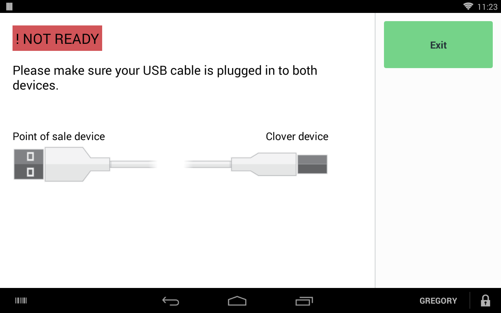
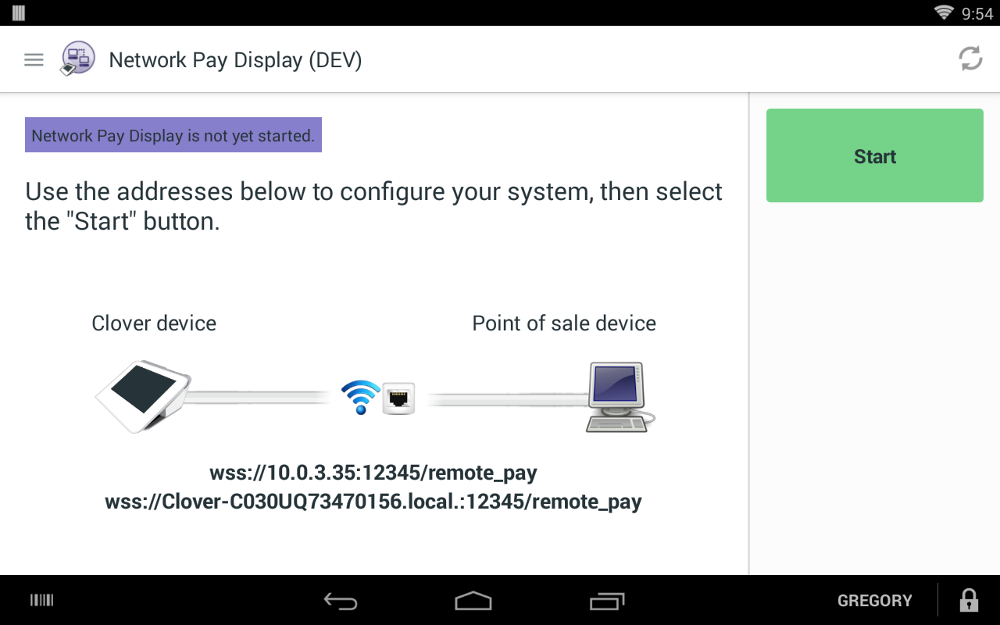
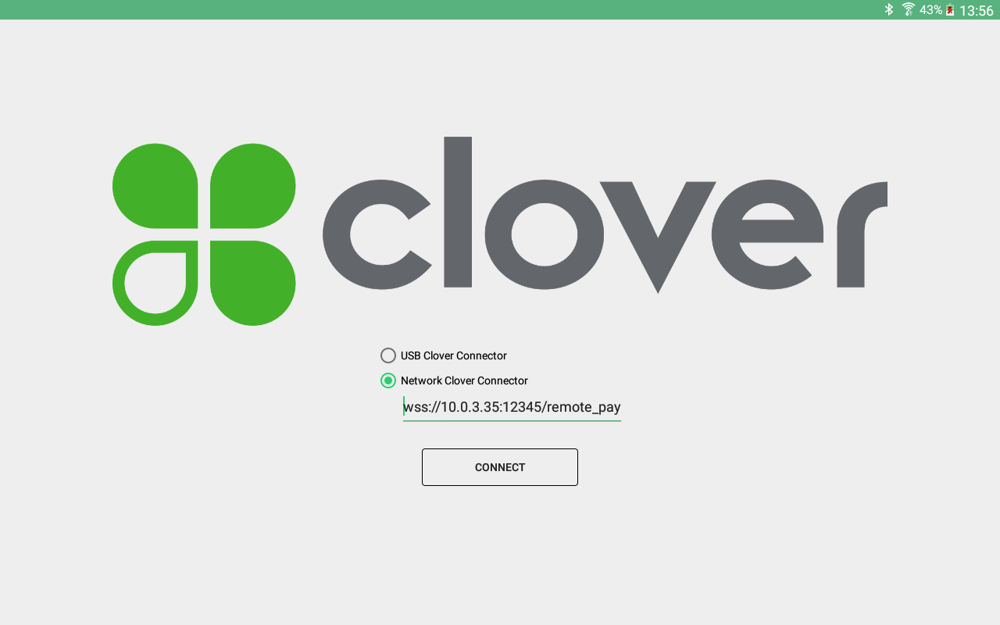
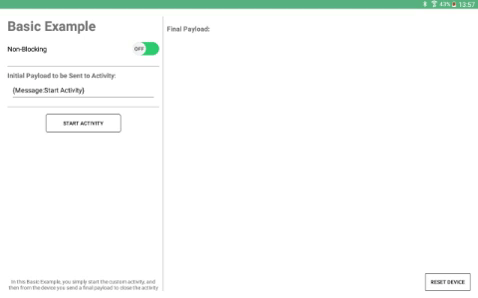
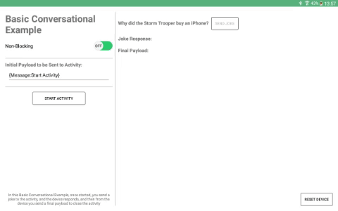
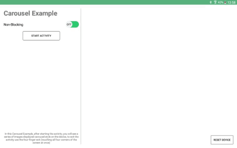
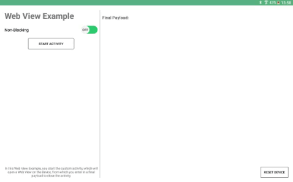
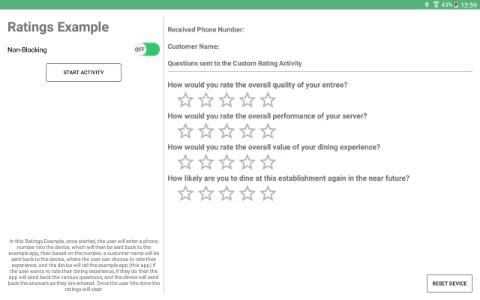
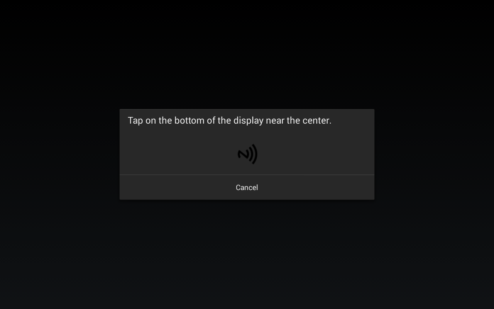

# 

## Clover Customer-Facing Platform SDK - Example App

This repository contains an example application that showcases features of the new Clover CFP (Customer-Facing Platform) SDK.

### Overview

A custom activity is an Android activity that you can install on semi-integrated Clover devices in the customer-facing mode through USB Pay Display, Secure Network Pay Display (SNPD), or Cloud Pay Display. Your POS can then communicate with this activity using the following `CloverConnector` methods:

|Method|Description  |
|--|--|
|`CloverConnector.startCustomActivity()`|Trigger a custom activity on the customer-facing Clover device|
| `CloverConnector.sendMessageToActivity()` |Send information to the custom activity|
| `CloverConnectorListener.onMessageFromActivity()` |Receive information from the custom activity|
| `CloverConnectorListener.onCustomActivityResult()` |Receive a result from the custom activity|

The `clover-cfp-sdk` provides a base implementation of an activity. You can extend the implementation to:

 - Set result values from a Custom Activity
 - Send and receive string messages between your POS and the Custom Activity that is running on the Clover device

With this SDK, you can trigger custom activities from your POS to a Clover device and create tailor-made customer experiences, such as tip selection, ratings and feedback, benefits program enrollment, and more. You can find the maven repository of the SDK [here](http://mvnrepository.com/artifact/com.clover.cfp/clover-cfp-sdk).

See the [Clover Developer Docs](https://docs.clover.com/clover-platform/docs/using-customer-facing-platform) for documentation and code snippets.

### Sample Application Setup

This sample application requires an Android device that is connected to a Clover device using either USB Pay Display or SNPD. Note that this can be done with two Clover Mini devices as well since both devices natively run Android. To get started, clone the following repository:

`git clone https://github.com/clover/CustomerFacingPlatformExamples.git`

You can also simply download and extract the ZIP file.

#### Installing Projects

You can start working with the application by performing the following tasks:

 1. Connect your computer to the Android device that will serve as your POS. Install the `CustomActivityApp` project on the Android device. There are 2 ways to do this:
  * In the project directory, run the `gradle installDebug` command, or
  * Run the project in Android Studio with the deployment target set as your attached device
 2. Install the activities that will interface with the `CloverConnector` methods (mentioned above). Note that these methods require an activity name as a parameter, and are triggered when a matching activity is found on the Clover device. Clone the [android examples repository](https://github.com/clover/android-examples) and install the project `clover-cfp-examples` through `gradle installDebug`.
 3. On the Clover device, run **USB Pay Display** (when tethered) or **Secure Network Pay Display** (when connected to the same network).
    

        
        
    

 4. Run `CustomActivityApp` from your Android device and connect using your selected Pay Display application.
    

        
    

### Features

#### Basic Example

- In the basic example, `CloverConnector.startActivity()` is used to send a JSON-like string payload to the Clover device.
- When you select **Finish** within the activity, the `setResultAndFinish()` method from `clover-cfp-sdk` is invoked. This method sends a payload back to the POS with `CloverConnector.onCustomActivityResult()`.
- The payload exchange between the Android device and Clover device represents a single Custom Activity **session**.

    

#### Basic Conversation Example

- When the Custom Activity session is started, `CloverConnector.sendMessageToActivity()` is used to send a joke text to the Clover Device.
- When you select **Send** within the activity, invokes the `sendMessage()` method from `clover-cfp-sdk` is invoked. This method sends a joke response payload back to the POS with `CloverConnector.onMessageFromActivity()`.
- Data can be exchanged indefinitely until the session is completed. The session is complete when the activity invokes `setResultAndFinish()` and the POS receives the signal with `CloverConnector.onCustomActivityResult()`. Note that in this example, only one response is exchanged. Select **Send** to end the Custom Activity session.

    

#### Carousel Example

A Custom Activity is started to display a photo stream on the customer-facing Clover Device. To exit to the main menu, touch the 4 corners of the device.

    

#### Web View Example

A Custom Activity that contains a web view is launched on the Clover device. With this web view, you can communicate with and send a message back to the POS.

    

#### Ratings Example

- A Custom Activity is launched on the Clover device for a customer to sign in and rate their dining experience.
- The activity sends back an authenticated customer's information to the POS. As the customer progresses through each question, the rating is sent to the POS until the activity is completed.
- To test this example, use the code `1111` on the screen requesting for a phone number.

    

#### NFC Example

A Custom Activity is launched on the Clover device. This enables the device to listen for an NFC tap, and then to send the tagged card serial number back to the POS (Note that this example currently works only on Bypass Fortress Cards).

    

